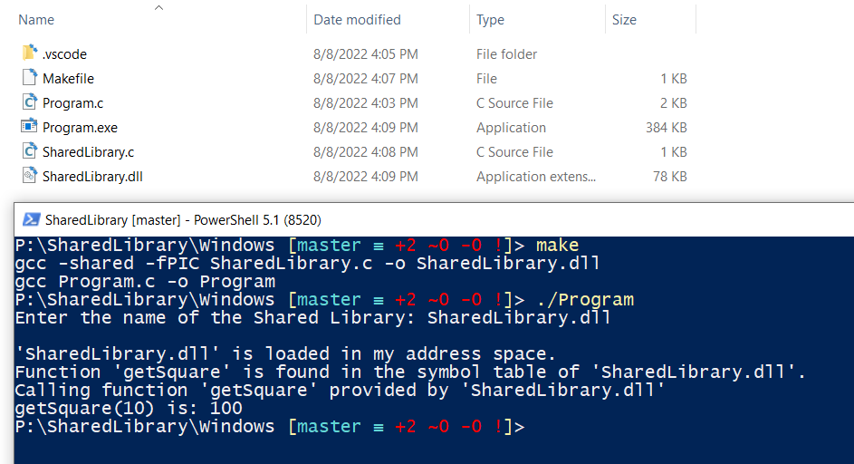

# Shared Library/Dynamic Library in C

### What are shared/dynamic libraries?
Shared/Dynamic libraries are libraries that are not linked at compile time but are linked dynamically at runtime. Therefore, they are not included in the executable.

They allow common codes to be bundled and used by applications on the system without loading multiple copies of it into memory.
They are compiled library files which are intended to be shared by executables.

### Why do we need a shared/dynamic library?

It's easier to maintain a single library than to maintain multiple applications. So, if multiple applications use the same library, then it's better to make the library shared/dynamic.

Shared/dynamic libraries contain several lines of code. Using shared/dynamic library help reduce the size of applications, since these libraries are not bundled with the executables. Besides, if we need to upgrade the library, we don't need to recompile all the applications.

#### Dependency:
*  gcc must be installed in order to use Makefile.

#### How to Build:
*  make

#### How to Use:
*  ./Program

### Screenshots Linux:

### Screenshots Windows:

